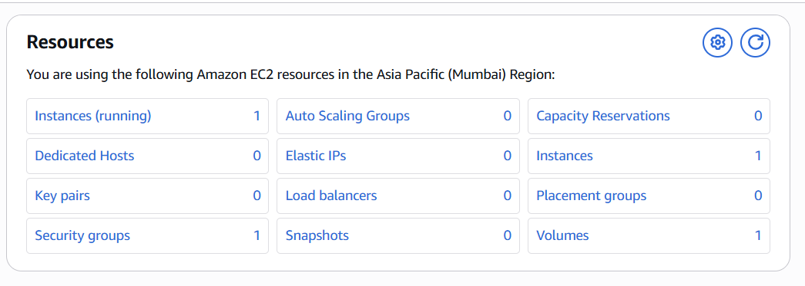
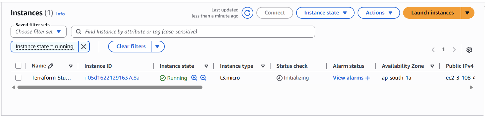

# Terraform AWS Assignment

This project demonstrates basic Terraform usage with AWS EC2.

## Resources Used

- Terraform
- AWS EC2
- Amazon Linux AMI
- t2.micro Instance

## Commands Used

```bash
terraform init
terraform plan
terraform apply
terraform destroy
```

## EC2 Instance Created



## Running Instance

